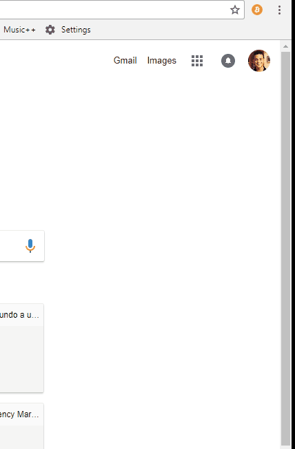

# crypto-timer-react
Chrome extension to get the cryptocurrencies prices.

## Demo
[Online Demo](https://alenkart.github.io/crypto-timer-react/)  


## Build on drive
In case you don't have React installed here is the build hosted on Google Drive.
[Build](https://drive.google.com/drive/folders/1YngAtd-gqJCvuFfTIbG1v7Eb1pm0_gxa)

## Installation
  1) Install the dependencies.
   ```
   yarn
   ```
  
  2) Build the react project.
  ```
  yarn build
  ```
  
  3) Chrome.
  
  4) Three dots on the top right corner.
  
  5) More tools.
  
  6) Extensions.
  
  7) Drop the "build" folder.
